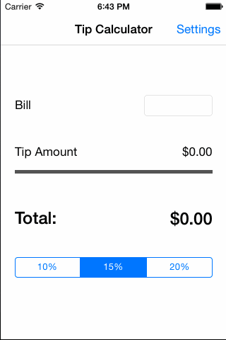

# Tip Calculator

Tip Calculator for the Introduction to iOS class.

Time spent: 2 hours spent in total

Completed user stories:

 * [x] Required: Basic tip calculator functionality of entering bill amount and choosing tip percentage
 * [x] Required: Settings Page that allows the user to set and store a default tip percentage

Notes:

Also added an Edit Change handler to the bill input field so that values are updated as you type.

Walkthrough of all user stories:

GIF created with [LiceCap](http://www.cockos.com/licecap/).
